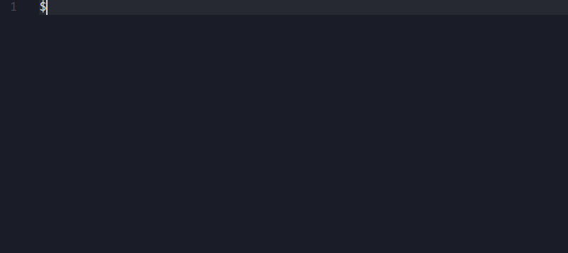

# appsync-resolver-autocomplete README

Adds autocomplete support for AppSync resolver templates when editing .vtl files.

## References

 - [Completions Sample](https://github.com/microsoft/vscode-extension-samples/blob/master/completions-sample/src/extension.ts)
 - [Resolver Mapping Template Reference](https://docs.aws.amazon.com/appsync/latest/devguide/resolver-mapping-template-reference.html)
